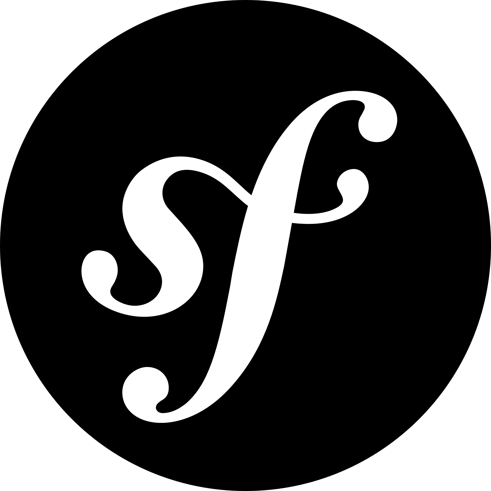

## About Me

### 10 more years experience in Software, ERP / CRM, Mobile Apps & Web development
### 5 more years experience in blockchain & web3 development
### 4 more years experience in in AI

I'm a software developer & Blockchain enthusist offering cutting edge Solution and Top notch products in various Industries. I provide services in various field like custom Software Development, Blockchain Development, Smart Contract Development, Full Stack Development , Web Apps Development , Mobile App Development, API development, Trading BOT development, Plugin Customisation & Web Design and Development. I have 10+ year experience in field of Blockchain, Php, Python, React, Vue, Node, Android and other MVC framework .

### Expertise in :

### BLOCKCHAIN DEVELOPMENT

Smart Contracts development with Solidity / Rust , Trading Or Exchange Development , Dapps , NFT Projects & NFT Marketplace with Minting Process , Node Bridges ( Ethereum , Tron , Binance Smart Chain , Polygon , Salona etc ) & API Integration , Crypto & FIAT Payment Gateway Integration , ICO / IDO , Launchpad & Staking Site Development with Analyzing Dashboard, Web3 Projects , P2P , Token Creation based on ERC20/ERC721/ERC1155 , BEP-20/BEP721/BEP1155 , TRC-20 etc. , Defi / Cefi Development , Volume BOTS , Trading BOTS , Liquidity Integration, Farming, Swaping, DAO, NFT Games, Metaverse, Orderbooks, Future Trading, Loan / Borrow ( Token or NFT ), Liquidate ( Pools or NFT Pools ) , Multichain and Bridging Apps for Transfer fund over networks , Crosschain, EVM Compactable chain ( Ethereum , BSC, Polygon, Optimism, Arbitrum etc. ) , Banking and Crypto finencial App, Spot Trading, Margin, Vesting Dapps, Non-EVM ( Multiversx , Solana , Near ) based NFT development etc.

### SOFTWARE + Web Apps + ERP / CRM DEVELOPMENT

Core Php , Python, , Golang, MVC , HMVC , Oops , Code Igniter , Laravel , Web API , Web Services , Vue.Js , React.js , Angular.js , Next.js, Nuxt.js, Ajax , JSON , Jquery , Cake Php , Symfony , Yii , Zend Framework

### E-COMMERCE DEVELOPMENT

Woo-commerce , Prestashop , Magento , Abentecart , Shopify , Open Cart , Zen Cart , Drupal Commerce , Virtue Cart ( Joomla ) , Jigoshop ( Wordpress ) , Os Commerce , X- Cart

### CMS DEVELOPMENT

Wordpress , Joomla , Drupal , Smarty , Concrete5

### MOBILE APPS DEVELOPMENT

Android , Native Platform Apps , Hybrid Apps , Cross Platform Apps

##  🥇 Main Skill

 

<table align="center">
<!-- skill -->
  <tr>
    <td align="center" width="90">
      
       Javascript
    </td>
    <td align="center" width="90">
      
       Typescript
    </td>
    <td align="center" width="90">
      
       Rust
    </td>
     <td align="center" width="90">
      
       Solidity
    </td>
    <td align="center" width="90">
      
       C++
    </td>
    <td align="center" width="90">
      
       GoLang
    </td>
    <td align="center" width="90">
      
       Python
    </td>
    <td align="center" width="90">
      
       PHP
    </td>
    <td align="center" width="90">
      
       Ruby
    </td>
    <td align="center" width="90">
      
       java
    </td>
  </tr>
<!-- framework -->
<tr>
<td align="center" width="90">
      
       Django
    </td>
    <td align="center" width="90">
      
       Fastapi
    </td>
    <td align="center" width="90">
      
       Flask
    </td>
    <td align="center" width="90">
      
       React
    </td>
    <td align="center" width="90">
      
       Next.js
    </td>
    <td align="center" width="90">
      
       Angular
    </td>
    <td align="center" width="90">
      
       Express
    </td>
    <td align="center" width="90">
      
       Nodejs
    </td>
        <td align="center" width="90">
      
       Nestjs
    </td>
    <td align="center" width="90">
      
       Laravel
    </td>
  </tr>
<!-- common -->
<!-- network -->
<tr>
  <td align="center" width="90">
      
       Ethereum
    </td>
    <td align="center" width="90">
      
       Solana
    </td>
    <td align="center" width="90">
      
       Bitcoin
    </td>
    <td align="center" width="90">
      
       Aptos
    </td>
    <td align="center" width="90">
      
       Polkadot
    </td>
    <td align="center" width="90">
      
       Cosmos
    </td>
    <td align="center" width="90">
      
       Polygon
    </td>
    <td align="center" width="90">
      
       Ton
    </td>
    <td align="center" width="90">
      
       Tron
    </td>
    <td align="center" width="90">
      
       Sui
    </td>
  </tr>

  <tr>
  <td align="center" width="90">
      
       NFT
    </td>
    <td align="center" width="90">
      
       Arbitrum
    </td>
    <td align="center" width="90">
      
       Avalanche
    </td>
    <td align="center" width="90">
      
       BSC
    </td>
    <td align="center" width="90">
      
       Celo
    </td>
    <td align="center" width="90">
      
       Chainlink
    </td>
    <td align="center" width="90">
      
       Fantom
    </td>
    <td align="center" width="90">
      
       Moon River
    </td>
    <td align="center" width="90">
      
       Optimism
    </td>
    <td align="center" width="90">
      
       Multiversx
    </td>
  </tr>
  
  <tr>
    <td align="center" width="90">
      
       TensorFlow
    </td>
    <td align="center" width="90">
      
       Llama
    </td>
    <td align="center" width="90">
      
       DeepSeek
    </td>
    <td align="center" width="90">
      
       LangChain
    </td>
    <td align="center" width="90">
      
       PyTorch
    </td>
    <td align="center" width="90">
      
       OpenAI
    </td>
    <td align="center" width="90">
      
       Hugging Face
    </td>
    <td align="center" width="90">
      
       Keras
    </td>
    <td align="center" width="90">
      
       SQL
    </td>
    <td align="center" width="90">
      
       MongoDB
    </td>
  </tr>

  <tr>
    <td align="center" width="90">
      
       CodeIgnitor
    </td>
    <td align="center" width="90">
      
       Woocommerce
    </td>
    <td align="center" width="90">
      
       Symfony
    </td>
    <td align="center" width="90">
      
       CakePhp
    </td>
    <td align="center" width="90">
      
       Yii
    </td>
    <td align="center" width="90">
      
       Wordpress
    </td>

  </tr>
  
</table>
